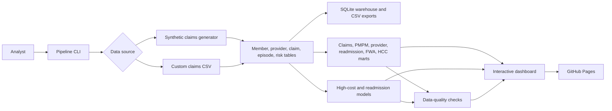

# Healthcare Claims Intelligence & Risk Analytics Platform
### A Medicare-style payer analytics command center for cost, utilization, risk, readmissions, provider outliers, and FWA review

Healthcare Claims Intelligence & Risk Analytics Platform is a production-ready portfolio project that turns synthetic or custom claims data into a governed analytics warehouse, predictive work queues, executive metrics, and a premium interactive dashboard.

[Live GitHub Pages App](https://birjung.github.io/healthcare-claims-intelligence-risk-analytics/) | [GitHub Repository](https://github.com/BIRJUNG/healthcare-claims-intelligence-risk-analytics) | [Deployment Workflow](https://github.com/BIRJUNG/healthcare-claims-intelligence-risk-analytics/actions/workflows/deploy-pages.yml)


---

## About This Repository

This repository simulates an enterprise payer analytics platform. It builds Medicare-style claims, member months, provider performance, utilization, readmissions, HCC/RAF-like risk segments, fraud/waste/abuse signals, and operational work queues.

The project is designed for healthcare analytics, payer BI, population health, risk adjustment, care management, utilization management, and payment integrity portfolio work.

It is not a chart-only dashboard. It is an end-to-end analytics product:

- data generation or custom claims ingestion
- governed star-schema-style tables
- SQLite warehouse and CSV mart exports
- PMPM and member-month calculations
- high-cost member identification
- provider peer benchmarking
- readmission episode analytics
- FWA anomaly scoring
- HCC/RAF-like risk analytics
- ML scoring for high-cost risk and readmission risk
- data-quality checks
- interactive glassmorphic dashboard
- GitHub Pages deployment

---

## Important Data Note

Default records are synthetic and generated for demonstration. They are not real patient, provider, payer, or adjudication records.

If you use custom claims data, do not commit PHI, member names, patient identifiers, medical record numbers, confidential payer contracts, or regulated healthcare data to a public repository.

---

## Live Product

| Resource | Link |
|---|---|
| Live app | https://birjung.github.io/healthcare-claims-intelligence-risk-analytics/ |
| Repository | https://github.com/BIRJUNG/healthcare-claims-intelligence-risk-analytics |
| Deployment workflow | https://github.com/BIRJUNG/healthcare-claims-intelligence-risk-analytics/actions/workflows/deploy-pages.yml |
| Blueprint | [docs/Healthcare_Claims_Intelligence_Project_Blueprint.md](docs/Healthcare_Claims_Intelligence_Project_Blueprint.md) |

---

## Product Index

[Dashboard](#dashboard) . [Use Cases](#business-use-cases) . [Architecture](#architecture) . [Custom Data](#custom-data-support) . [Testing](#quality-assurance) . [Deployment](#deployment) . [Roadmap](#roadmap)

---

## Business Use Cases

| Business question | Platform answer |
|---|---|
| Which members drive the most paid cost? | High-cost member mart with paid amount, utilization, chronic burden, RAF-like score, and intervention recommendation |
| Where is PMPM trending upward? | Member-month PMPM mart by month, state, and plan type |
| Which inpatient stays lead to 30-day readmission? | Readmission mart and scored discharge work queue |
| Which providers are cost or utilization outliers? | Provider peer benchmark mart and outlier score |
| Which claims or providers need FWA review? | FWA queue with duplicate-like, high-cost, and provider anomaly signals |
| Which members may need risk adjustment review? | HCC/RAF-like segmentation and suspected gap count |
| How can leaders see it quickly? | Premium interactive dashboard with filters, work queues, and export |

---

## Feature Index

| Area | Features |
|---|---|
| Claims finance | Allowed amount, paid amount, member responsibility, PMPM, claim mix |
| Population health | Chronic condition burden, high-cost members, intervention tiers |
| Utilization | Admissions, ED visits, pharmacy, avoidable ED, inpatient days |
| Readmissions | 30-day readmission flags, episode queue, follow-up recommendation |
| Provider performance | Peer cost percentile, utilization percentile, quality score, outlier score |
| Payment integrity | FWA anomaly queue, duplicate-like patterns, high-cost claim flags |
| Risk adjustment | HCC count, RAF-like score, suspected gap logic |
| Machine learning | High-cost model, readmission model, provider anomaly scoring |
| Dashboard | Search, filters, sorting, modals, local triage state, CSV export |
| Deployment | Static site artifact, GitHub Actions, GitHub Pages |

---

## Dashboard

The dashboard is a standalone HTML web app with embedded analytics data.

It includes:

- executive KPI strip
- PMPM and utilization trend charts
- cost concentration by risk segment
- provider outlier matrix
- high-cost member queue
- readmission queue
- FWA review queue
- HCC/RAF risk table
- quality and model governance panel
- dark and light visual system
- browser-local triage status

---

## Architecture



---

## Repository Structure

```text
healthcare-claims-intelligence-risk-analytics/
|
|-- README.md
|-- requirements.txt
|-- pyproject.toml
|
|-- src/
|   |-- claims_intelligence/
|       |-- config.py
|       |-- custom_data.py
|       |-- data_generation.py
|       |-- documentation.py
|       |-- marts.py
|       |-- models.py
|       |-- pipeline.py
|       |-- quality.py
|       |-- reporting.py
|       |-- warehouse.py
|
|-- scripts/
|   |-- run_healthcare_claims_pipeline.py
|   |-- serve_dashboard.py
|   |-- build_static_site.py
|
|-- tests/
|   |-- test_pipeline.py
|
|-- docs/
|   |-- Healthcare_Claims_Intelligence_Project_Blueprint.md
|
|-- data/
|   |-- raw/
|       |-- custom_claims_template.csv
|
|-- .github/
|   |-- workflows/
|       |-- deploy-pages.yml
```

---

## Tech Stack

| Layer | Tools |
|---|---|
| Language | Python 3.11+ |
| Data | pandas, NumPy |
| ML | scikit-learn |
| Warehouse | SQLite |
| Visuals | Plotly |
| UI | HTML, CSS, JavaScript |
| Tests | pytest |
| CI/CD | GitHub Actions |
| Hosting | GitHub Pages |

---

## Getting Started

### 1. Clone

```powershell
git clone https://github.com/BIRJUNG/healthcare-claims-intelligence-risk-analytics.git
cd healthcare-claims-intelligence-risk-analytics
```

### 2. Install

```powershell
python -m venv .venv
.\.venv\Scripts\Activate.ps1
pip install -r requirements.txt
```

### 3. Build

```powershell
python scripts\run_healthcare_claims_pipeline.py
```

### 4. Serve Locally

```powershell
python scripts\serve_dashboard.py
```

Open:

```text
http://127.0.0.1:8061/reports/dashboard/healthcare_claims_intelligence_dashboard.html
```

---

## Useful Commands

Build a larger synthetic dataset:

```powershell
python scripts\run_healthcare_claims_pipeline.py --claims 25000 --members 7000 --seed 42
```

Build from custom data:

```powershell
python scripts\run_healthcare_claims_pipeline.py --custom-claims data\raw\custom_claims_template.csv
```

Build static site:

```powershell
python scripts\build_static_site.py
```

Run tests:

```powershell
python -m pytest
```

---

## Custom Data Support

The importer accepts flexible column names for claims, members, providers, payments, dates, and risk fields.

Recommended minimum columns:

```text
claim_id,member_id,provider_id,provider_name,specialty_group,claim_type,service_line,diagnosis_group,allowed_amount,paid_amount,claim_from_date,claim_thru_date,state_code,plan_type
```

Useful optional fields:

```text
member_responsibility_amount,inpatient_flag,ed_flag,readmission_flag,chronic_condition_count,raf_like_score
```

The sample template is available at:

```text
data/raw/custom_claims_template.csv
```

---

## Main Outputs

| Output | Path |
|---|---|
| SQLite warehouse | `data/processed/healthcare_claims_intelligence.db` |
| Interactive dashboard | `reports/dashboard/healthcare_claims_intelligence_dashboard.html` |
| Static web artifact | `dist/index.html` |
| Executive summary | `reports/executive_summary.md` |
| Quality report | `reports/data_quality_report.csv` |
| Model metrics | `data/processed/model_metrics.json` |
| High-cost member mart | `data/processed/mart_high_cost_member.csv` |
| Provider performance mart | `data/processed/mart_provider_performance.csv` |
| Readmission queue | `data/processed/mart_readmission_queue.csv` |
| FWA queue | `data/processed/mart_fwa_queue.csv` |

---

## Quality Assurance

```powershell
python -m pytest
```

The test suite verifies:

- generated healthcare claims integrity
- member-month PMPM outputs
- readmission and provider marts
- model scoring
- quality gates
- end-to-end dashboard and warehouse creation
- custom claims CSV ingestion

---

## Deployment

The GitHub Actions workflow:

1. installs dependencies
2. builds the analytics project
3. runs tests
4. creates `dist/index.html`
5. deploys to GitHub Pages

Live app:

```text
https://birjung.github.io/healthcare-claims-intelligence-risk-analytics/
```

---

## Roadmap

| Phase | Upgrade |
|---|---|
| 1 | Standalone portfolio dashboard and deployment |
| 2 | Upload UI for custom claims mapping |
| 3 | Durable analyst queues with authentication |
| 4 | Official CMS-HCC coefficient integration |
| 5 | SHAP explainability panels |
| 6 | Production backend with audit logging and PHI controls |

---

## Author

Built by [Birjung Thapa](https://github.com/BIRJUNG).

This project demonstrates payer analytics architecture, claims finance, PMPM logic, readmission analytics, provider benchmarking, FWA review, HCC/RAF-style risk segmentation, ML scoring, UI design, testing, and public deployment.

